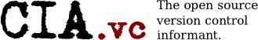

# CIA.vc - The message informant system

*This is the original and updated source code* 
*for the [CIA.vc](http://cia.vc/) project run by Micah Dowty.*

### What's changed?

Well, a lot has changed. The original source wasnt even working, combining this code with the working copy
of the virtual machine Micah used to offer for download has resulted in this codebase being usable.

I have successfully updated everything to Python 3.7 and updated to modern versions of Django, removing code
which is no longer relevant to today's modern web technologies. The core, when Micah abandoned the project,
was in a state of transition. Django was new and so were most modern web technologies we have today. As a result
all of the stats websites are on an older web technology while Django runs the rest of the site. Most of the
core uses XML-based technologies (instead of JSON like we would use today). The core has come a long way
internally to make it work again but it has a long way to go.

I plan to support platforms outside of just IRC (such as Discord, email, mobile push, and possibly Slack) once
the core is more maintainable.

### Why bother? We have GitHub and we just use it's own IRC/Discord bots.

Well, the solutions since CIA.vc has fallen have been medocre at best. While GitHub does have discord and
IRC bots to announce in various channels, they do not allow the same kind of experience that CIA's ruleset
system does: You can 'listen' to certain projects in your own discord/irc server without having to go
patronize the developers or repo maintainers to add your webhook url to their project. This was something
I missed when CIA.vc did go offline.

Personally I hate that the internet has just become dominated by HTML and browsers, and I would rather have
some kind of real-time notification in one of my chat programs instead of having to go to github.com and 
ask it "Hey, what updates do I have on this project?"